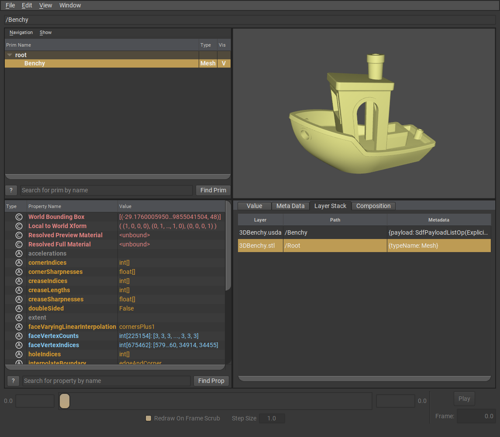
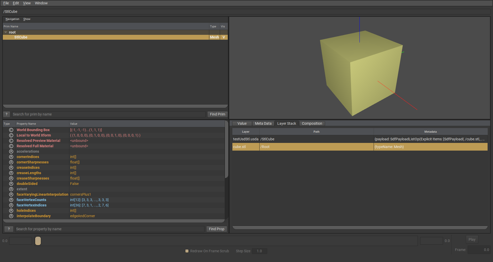

# usdStl - A USD plugin for STL files

This repo contains an [USD](https://openusd.org) [file format plugin](https://graphics.pixar.com/usd/release/api/sdf_page_front.html#sdf_fileFormatPlugin) to expose [STL files](https://en.wikipedia.org/wiki/STL_(file_format)).



## Build

### Requirements

- [CMake](https://cmake.org/)
- A [USD distribution](https://developer.nvidia.com/usd#bin)

The Point `PXR_CONFIG_CMAKE` to the `pxrConfig.cmake` file (usually located at the root of the USD distribution folder.

### Build commands

```
# Generate the build files

cmake ../usdPly -DCMAKE_INSTALL_PREFIX=/tmp/usdStl -DPXR_CONFIG_CMAKE=~/opt/USD-v22.08-amd64-py39/pxrConfig.cmake

# Build and test usdPly

cmake --build .
cmake --build . --target test

# Install usdPly to CMAKE_INSTALL_PREFIX
# /tmp/usdStl
# ├── usdStl
# │   └── resources
# │       └── plugInfo.json
# └── usdStl.so

cmake --build . --target install
```

## Running

Add the path to the installed `pluginInfo.json` to the environment variable `PXR_PLUGINPATH_NAME` then run `usdview src/testenv/testUsdStl.usda`. If everything is setup correctly a cube should be shown.



## Acknowledgment

- STL parser by [Sebastian Reiter](https://github.com/sreiter/stl_reader)
- The boat featured in the screenshot is [3DBenchy](https://www.3dbenchy.com/) (downloaded from [GitHub](https://github.com/CreativeTools/3DBenchy/))
